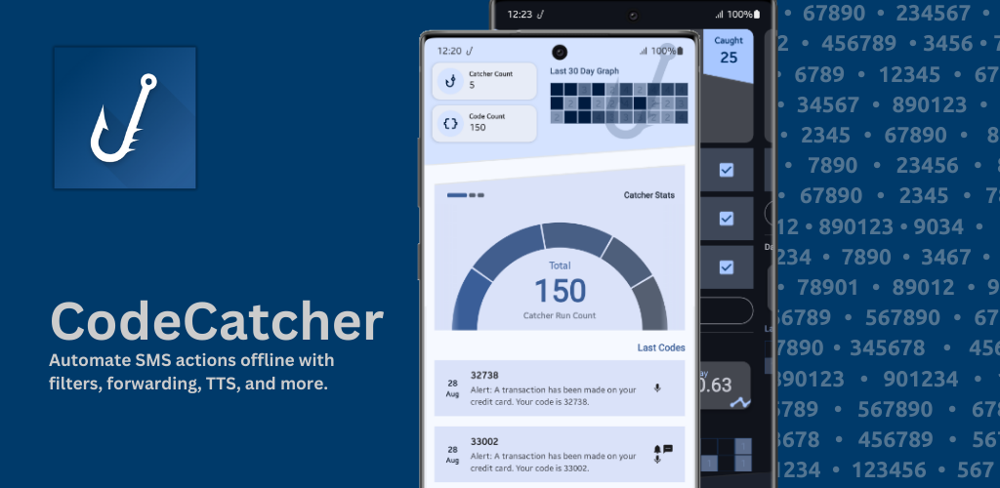
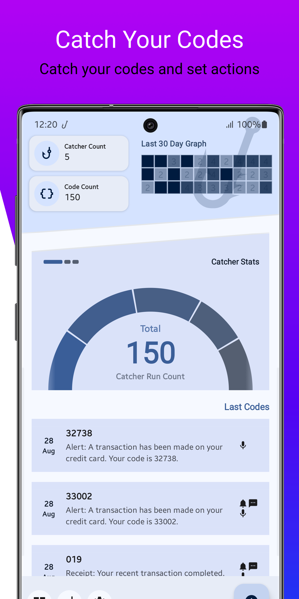
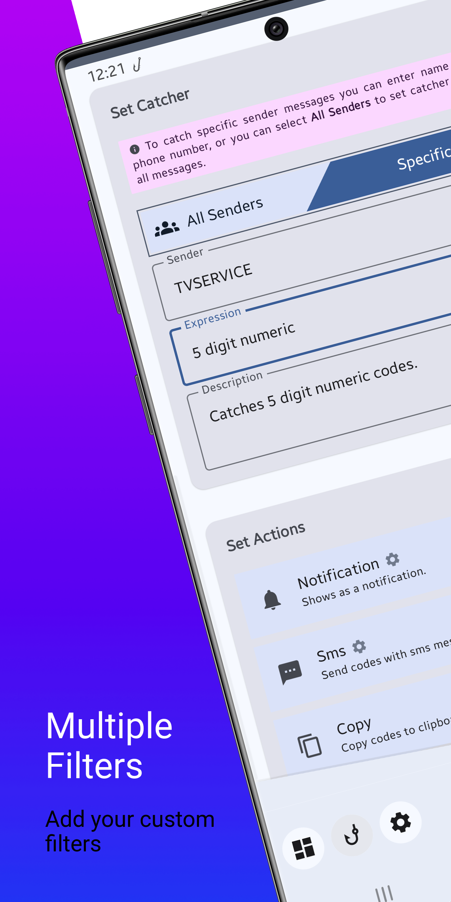
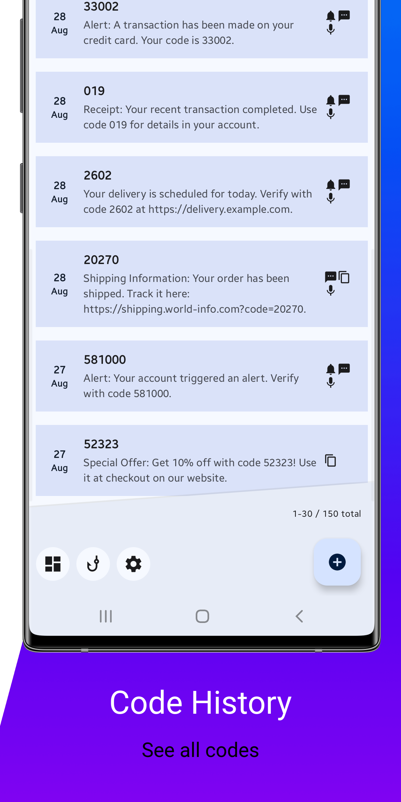
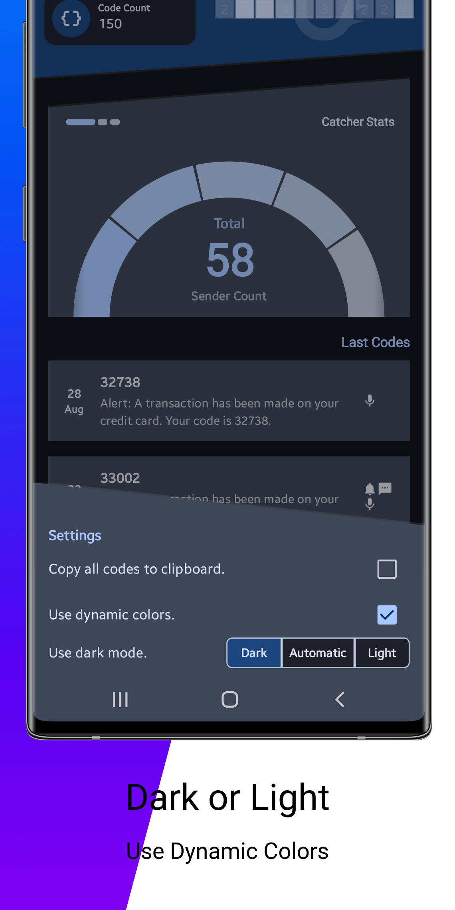

# CodeCatcher
<center>
  


</center>

CodeCatcher is a versatile SMS filtering app designed to automatically intercept and process SMS messages based on user-defined rules. It offers automation features, such as SMS forwarding and clipboard actions, to streamline SMS management. CodeCatcher helps you stay organized and improve your phone’s SMS handling capabilities.

## Screenshots


|  |  |  |  |
|--------------------------------------------------------------|--------------------------------------------------------------|--------------------------------------------------------------|--------------------------------------------------------------|

## Features

- **SMS Filtering**: Define rules to filter incoming SMS based on content, sender, and more.
- **SMS Forwarding**: Automatically forward specific SMS to another phone number or email address.
- **Clipboard Actions**: Copy text from SMS messages to your clipboard for easy access.
- **Device Automation**: Automate responses or actions based on received SMS messages.
- **Customizable Filters**: Easily modify or add new filters to suit your needs.

## Permissions

CodeCatcher requires the following permissions:

- **SMS Permissions**: To read and process incoming SMS messages.
- **Send SMS**: To forward SMS or send automated replies.
- **Read Phone State**: To detect incoming messages and trigger actions.

These permissions are necessary for the core functionality of the app, ensuring that CodeCatcher can perform actions like filtering, forwarding, and automation based on your needs.

## Releases

You can download APK from releases page. You can test apk signs.

```bash
apksigner verify --print-certs CodeCatcher.apk 
Signer #1 certificate DN: C=TR, ST=Ankara, CN=CodeCatcher
Signer #1 certificate SHA-256 digest: 84f46d19e38d5197f4082bc58f186114efe8799d3ebe31f6e9b094d0b6195e55
Signer #1 certificate SHA-1 digest: 3e9243b677f0adf01f9d4da7aa8cf5c704793b74
Signer #1 certificate MD5 digest: 24dc0643fe273d6af6f8af036e903238

```

## Installation

You can install CodeCatcher from [F-Droid](https://f-droid.org/) or build the app from source using the steps below:

1. Clone the repository:
   ```bash
   git clone https://github.com/headersalreadysent/tinycodecatcher.git
   ```

2. Build the APK:
   ```bash
   ./gradlew assembleRelease
   ```

3. Install the APK on your Android device:
   ```bash
   adb install app/build/outputs/apk/release/app-release-unsigned.apk
   ```

## How to Use

1. **Create Filters**: Go to the "Filters" tab to define your filtering rules.
2. **Enable Actions**: Choose actions like forwarding SMS, copying text to the clipboard, etc.
3. **Configure Automation**: Set up automation triggers based on received SMS content.

CodeCatcher allows you to create multiple filters with various conditions to handle incoming SMS messages automatically. Customize it to suit your daily workflow.


## License

CodeCatcher is licensed under the **GPL-3.0-or-later** license. You can freely modify and distribute the app according to the terms of the GPL-3.0 license. See the [LICENSE](LICENSE) file for more details.

## Contributing

If you’d like to contribute to CodeCatcher, please fork the repository, create a new branch, and submit a pull request. We welcome improvements, bug fixes, and new features!

### Contact

If you have any questions or feedback, feel free to open an issue on GitLab or reach out via email.

- Email: [proxied](mailto:code-catcher-translate@proxiedmail.com)

---

Thank you for using CodeCatcher!
